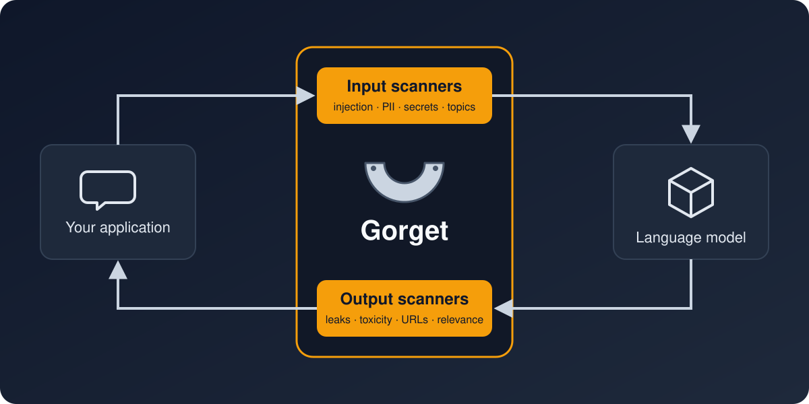

<p align="center">
  
</p>

<h1 align="center">Gorget</h1>

<p align="center">
  Сканеры безопасности для запросов к языковым моделям и их ответов: prompt injection,
  персональные данные, секреты, токсичность и другое.<br>
  Поддерживаемое продолжение LLM Guard. Работает на CPU без PyTorch.
</p>

<p align="center">
  <a href="https://github.com/Perruer/gorget/actions/workflows/test.yml"></a>
  <a href="LICENSE"></a>
  
  <a href="README.md"></a>
</p>



Gorget стоит между вашим приложением и языковой моделью. Входные сканеры проверяют запрос до
того, как он попадёт в модель, выходные — ответ до того, как его увидит пользователь. Сканер
может очистить текст (например, заменить телефон заглушкой) или признать его недопустимым и
вернуть оценку риска.

## Зачем Gorget

[LLM Guard](https://github.com/protectai/llm-guard) от Protect AI был одним из самых популярных
открытых инструментов для этой задачи. Protect AI купила Palo Alto Networks, и 8 июля 2026 года
репозиторий заархивировали. Его по-прежнему скачивают около 100 тысяч раз в месяц, но последняя
версия закрепляет `transformers` с опубликованными уязвимостями, не ставится на Python 3.13 и
доустанавливает модели spaCy через pip прямо во время работы сервиса.

Gorget сохраняет API LLM Guard и чинит то, что сломалось:

| | LLM Guard 0.3.16 | Gorget 0.5 |
|---|---|---|
| PyTorch | обязателен (с CUDA — несколько гигабайт) | не нужен: все сканеры работают на ONNX Runtime |
| Python | 3.10–3.12 | 3.10–3.14 |
| Зависимости | `transformers==4.51.3`, `presidio==2.2.358` с известными уязвимостями | актуальные версии |
| Скачивания во время работы | модели spaCy через pip, данные NLTK | нет; работает офлайн |
| Персональные данные РФ | нет | ИНН, СНИЛС, ОГРН, паспорт, телефоны, ФИО |
| Лицензии моделей | не указаны; модель анонимизации по умолчанию — некоммерческая | [список](docs/models.md), предупреждение и замена под Apache-2.0 |
| `MaliciousURLs` | сломан: модель удалили | работает через ONNX-экспорт |
| Свои модели | только путь к модели; метки кроме `INJECTION` читались наоборот | любой классификатор и NER-модель, категории инъекций, свои типы данных, плагины в конфиге сервера |
| Атаки из нескольких сообщений | не проверялись | история диалога: последние сообщения вместе, ответы инструментов, накопленный риск |

## Установка

```bash
pip install gorget
```

Так ставится Gorget с ONNX Runtime, без PyTorch. Для GPU или если вам привычнее PyTorch:

```bash
pip install "gorget[torch]"
```

## Быстрый старт

```python
from gorget import scan_output, scan_prompt
from gorget.input_scanners import Anonymize, PromptInjection, TokenLimit, Toxicity
from gorget.output_scanners import Deanonymize, NoRefusal, Relevance, Sensitive
from gorget.vault import Vault

vault = Vault()
input_scanners = [Anonymize(vault), Toxicity(), TokenLimit(), PromptInjection()]
output_scanners = [Deanonymize(vault), NoRefusal(), Relevance(), Sensitive()]

sanitized_prompt, valid, scores = scan_prompt(input_scanners, prompt)
if not all(valid.values()):
    raise ValueError(f"Запрос отклонён: {scores}")

response = call_your_llm(sanitized_prompt)

sanitized_response, valid, scores = scan_output(output_scanners, sanitized_prompt, response)
```

## Персональные данные на русском

```python
from gorget.input_scanners import Anonymize
from gorget.vault import Vault

scanner = Anonymize(Vault(), language="ru")
text, is_valid, risk = scanner.scan("Меня зовут Иван Петров, ИНН 500100732259, СНИЛС 112-233-445 95.")
# Меня зовут [REDACTED_PERSON_1], ИНН [REDACTED_RU_INN_1], СНИЛС [REDACTED_RU_SNILS_1].
```

ФИО и адреса находит русская NER-модель. ИНН, СНИЛС и ОГРН засчитываются, только если сходится
контрольная сумма, поэтому номера заказов и телефонов не маскируются по ошибке. Паспорт
распознаётся по серии (код региона и год выдачи) и словам рядом («паспорт», «серия», «выдан»).
Подходит для фильтрации персональных данных перед отправкой во внешние модели (152-ФЗ).
Подробности — в [документации Anonymize](docs/input_scanners/anonymize.md#russian-personal-data).

## Переход с LLM Guard

```bash
pip uninstall llm-guard
pip install gorget
```

Код менять не нужно: вместе с Gorget ставится пакет совместимости `llm_guard`, который отдаёт те же
классы, а `LLMGuardValidationError` — псевдоним `GorgetValidationError`. Импорты можно переименовать
в `gorget`, когда будет удобно.

## Свои модели

Можно подключить свой классификатор инъекций, свои NER-модели и свои типы чувствительных данных:

```python
import re
from gorget.input_scanners import Anonymize, PromptInjection
from gorget.plugins import CallableRecognizer, Entity
from gorget.vault import Vault

injection = PromptInjection(classifier=acme_classifier, injection_labels=["jailbreak", "prompt_leak"])

def contract_numbers(text, language):
    for m in re.finditer(r"\bCTR-\d{6}\b", text):
        yield Entity("CONTRACT_NUMBER", m.start(), m.end(), 0.9)

anonymize = Anonymize(Vault(), recognizers=[CallableRecognizer(contract_numbers, entities=["CONTRACT_NUMBER"])])
anonymize.scan("Договор CTR-123456")  # 'Договор [REDACTED_CONTRACT_NUMBER_1]'
```

Сервер API принимает те же плагины по пути импорта в YAML-конфиге или через entry points.
Подробности — в разделе [Свои модели](docs/customization/custom_models.md).

## Атаки из нескольких сообщений

```python
from gorget.conversation import ConversationRisk, scan_conversation

result = scan_conversation(scanners, messages, risk=ConversationRisk.from_scanner(injection))
```

`scan_conversation` принимает историю диалога в формате OpenAI и, кроме последнего сообщения,
проверяет последние сообщения пользователя вместе (инструкция, разбитая на части), ответы
инструментов (непрямая инъекция) и по желанию риск, накопленный за диалог. У сервера для этого
есть `/analyze/conversation`. Что это ловит, а что нет, — в разделе
[Атаки из нескольких сообщений](docs/tutorials/conversations.md).

## Сервер API

FastAPI-сервер с теми же сканерами лежит в [gorget_api](gorget_api). Образ работает на ONNX Runtime
и не требует GPU:

```bash
docker build -f gorget_api/Dockerfile -t gorget-api .
docker run -p 8000:8000 -e AUTH_TOKEN=change-me gorget-api
```

Встроенная интеграция [LiteLLM](docs/tutorials/litellm.md) с LLM Guard работает с ним без изменений.

## Модели и лицензии

Модели скачиваются с Hugging Face при первом использовании, у каждой своя лицензия. Часть из них
**некоммерческие**, в том числе модель по умолчанию для `Anonymize` и `Sensitive`, доставшаяся от
LLM Guard. Полный список — в [docs/models.md](docs/models.md); при загрузке некоммерческой модели
Gorget пишет предупреждение в лог.

## Поддержать проект

Gorget бесплатный и открытый. Если он защищает ваш продукт, проект можно поддержать:

- [Boosty](https://boosty.to/mikio_kuroki/donate)
- USDT или TRX (TRC-20): `TXUBW4e88SDTfrnJRKfbhYfFcggufbonc1`
- USDT, USDC или ETH (ERC-20): `0x1378491169064702786b2E5b58c6375776177E8A`
- TON или USDT в сети TON: `UQAhI7EKzoa-JuKOfv0ULMzA3FrmpxsDkXj8Qevwj2z1cMRN`

## Авторы и лицензия

Gorget основан на LLM Guard от Protect AI и его участников. Оба проекта распространяются по
[лицензии MIT](LICENSE); о встроенных данных — в [NOTICE](NOTICE). Оригинальный README сохранён в
[docs/upstream-README.md](docs/upstream-README.md).

Gorget — независимый проект, не связанный с Protect AI и Palo Alto Networks и не одобренный ими.
Название «LLM Guard» используется только для описания совместимости.
