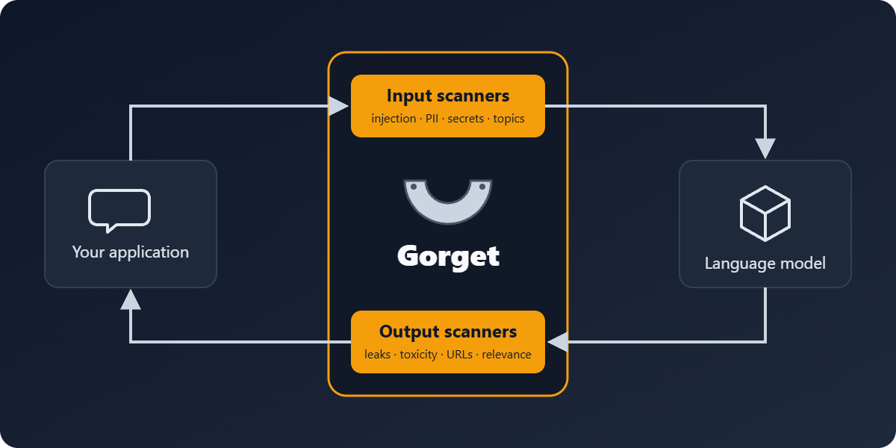

# Gorget - The Security Toolkit for LLM Interactions

Gorget is a comprehensive tool designed to fortify the security of Large Language Models (LLMs). It continues [LLM Guard](https://github.com/protectai/llm-guard), which Protect AI archived in July 2026: code written for `llm_guard` keeps working.

[**Changelog**](./changelog.md)

## What is Gorget?



By offering sanitization, detection of harmful language, prevention of data leakage, and resistance against prompt
injection attacks, Gorget ensures that your interactions with LLMs remain safe and secure.

## Installation

Begin your journey with Gorget by downloading the package:

```sh
pip install gorget
```

## Getting Started

**Important Notes**:

- Gorget is designed for easy integration and deployment in production environments. While it's ready to use
  out-of-the-box, please be informed that we're constantly improving and updating the repository.
- Base functionality requires a limited number of libraries. As you explore more advanced features, necessary libraries
  will be automatically installed.
- Ensure you're using Python version 3.9 or higher. Confirm with: `python --version`.
- Library installation issues? Consider upgrading pip: `python -m pip install --upgrade pip`.

**Examples**:

- Get started with [ChatGPT and Gorget](https://github.com/Perruer/gorget/blob/main/examples/openai_api.py).

## Community, Contributing, Docs & Support

Gorget is an open source solution.
We are committed to a transparent development process and highly appreciate any contributions.
Whether you are helping us fix bugs, propose new features, improve our documentation or spread the word,
we would love to have you as part of our community.

- Give us a ⭐️ github star ⭐️ on the top of this page to support what we're doing,
  it means a lot for open source projects!
- Read our
  [docs](https://perruer.github.io/gorget/)
  for more info about how to use and customize Gorget, and for step-by-step tutorials.
- Post a [Github
  Issue](https://github.com/Perruer/gorget/issues) to submit a bug report, feature request, or suggest an improvement.
- To contribute to the package, check out our [contribution guidelines](https://github.com/Perruer/gorget/blob/main/CONTRIBUTING.md), and open a PR.
